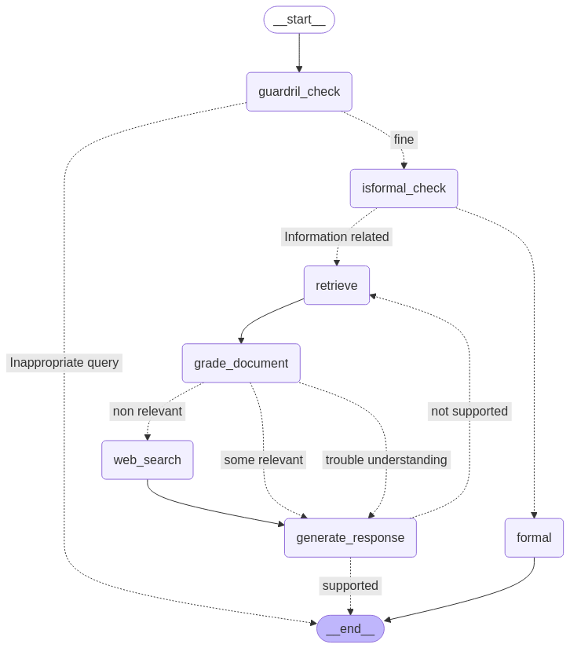

# RAG Project



This project implements a **Retrieval-Augmented Generation (RAG)** pipeline using **LangChain**, **ChatGroq**, and **Streamlit**. It is designed to take user queries, retrieve relevant documents, process the query through multiple validation steps, and generate a final response.

## Features

- **Upload a PDF** to use as a knowledge base.
- **Provide a Groq API key** and choose an LLM model.
- **Retrieve relevant documents** from the uploaded PDF.
- **Run multiple validation steps**, including guardrail checks, query classification, and hallucination detection.
- **Generate a response** using ChatGroq and display it in the Streamlit UI.

---

## Installation

### 1. Clone the repository

```bash
git clone https://github.com/your-username/rag.git
cd rag
```

### 2. Create and activate the virtual environment
```bash
conda create -p venv python==3.10 -y
requirements.txt
Conda activate venv/
pip install -r requirements.txt
```
### 3. Install dependencies:
```bash
pip install -r requirements.txt
```
### 4. Install dependencies:
```bash
streamlit run main.py
```

## Project Structure
```bash
rag
├── config.py             # LLM configuration and API setup
├── flow.py               # Main logic for processing queries
├── guardrail.py          # Guardrail checks for content filtering
├── hallucination.py      # Detects potential hallucinations in responses
├── grade_doc.py          # Grades retrieved documents for relevance
├── isformal.py           # Checks the formality of responses
├── generate_response.py  # Generates final responses from the LLM
├── main.py               # Streamlit UI for user interaction
├── requirements.txt      # Required dependencies
└── README.md             # Project documentation
```