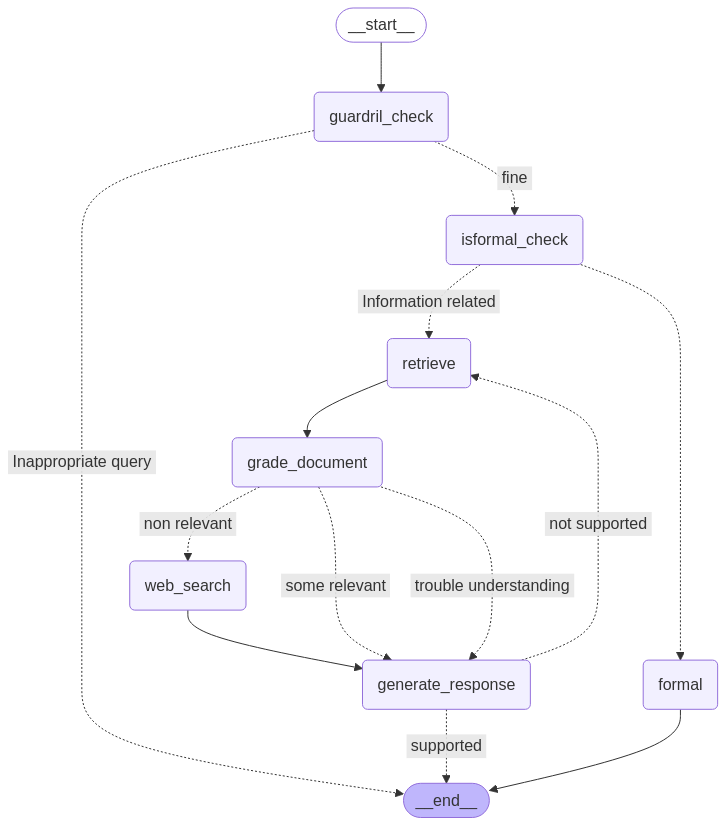

# 🧠 Agentic RAG

An intelligent, production-grade document question-answering system powered by a multi-node agentic
retrieval-augmented generation (RAG) pipeline built with LangChain, LangGraph, Groq LLMs, FAISS, and Streamlit.

---

## Architecture

It uses a stateful LangGraph pipeline where each stage is a discrete node. The pipeline adapts
dynamically based on the query type and retrieval quality.



### Pipeline Nodes

| Node | Purpose |
|------|---------|
| Guardrail | Blocks harmful, abusive, or policy-violating queries |
| Formality Check | Routes casual/chitchat queries away from the RAG pipeline |
| Formal Responder | Handles conversational queries directly with the LLM |
| Document Retrieval | Semantic search via FAISS over all uploaded PDFs |
| Document Grading | Filters out irrelevant retrieved chunks |
| Increment Attempts | Pure state node that increments the retry counter |
| Web Search | Tavily web search fallback when documents lack the answer |
| Generate Response | Generates a Markdown-formatted answer using retrieved context |
| Hallucination Check | Verifies the generated answer is grounded in retrieved facts |
| Fallback | Returns a canned "could not find information" response after max attempts |

---

## Features

- **Multi-PDF support** : Upload and query across multiple PDFs simultaneously
- **Conversation memory** : Last 3 turns of Q&A are prepended as context for follow-up questions
- **Pipeline trace** : Expandable section in UI shows which nodes were visited
- **Source attribution** : Each answer shows which PDF and page the information came from
- **Hallucination detection** : Responses are verified before being shown
- **Web search fallback** : Falls back to Tavily web search when documents can't answer
- **Max attempts guard** : After 3 failed retrieval attempts, returns a graceful fallback instead of hallucinating

---

## Local Setup

### Prerequisites

- Python 3.10+
- A [Groq API key](https://console.groq.com)
- A [HuggingFace token](https://huggingface.co/settings/tokens)
- A [Tavily API key](https://tavily.com)

### Installation

```bash
git clone https://github.com/your-username/docmind.git
cd RAG

python -m venv venv
source venv/bin/activate        # On Windows: venv\Scripts\activate

pip install -r requirements.txt
```

### Configuration

create `.env` with your actual API keys:

```
GROQ_API_KEY=gsk_your_actual_key
HF_TOKEN=hf_your_actual_token
TAVILY_API_KEY=tvly-your_actual_key
DEFAULT_MODEL=llama-3.3-70b-versatile
```

### Running Locally

```bash
streamlit run main.py
```

The app will open at `http://localhost:8501`.


## Project Structure

```
RAG/
├── .env.example                  # Template for environment variables
├── image/
│   └── graph.png                 # LangGraph pipeline visualization
├── config.py                     # LLM factory and environment loading
├── state.py                      # LangGraph typed state definition
├── guardrail.py                  # Policy compliance check node
├── isformal.py                   # Query formality classification node
├── grade_document.py             # Document relevance grading node
├── hallucination.py              # Hallucination detection router
├── generate_response.py          # RAG response generation node
├── web_search.py                 # Tavily web search fallback node
├── flow.py                       # LangGraph pipeline assembly and caching
├── main.py                       # Streamlit UI
├── requirements.txt              # Pinned Python dependencies
└── README.md                     # This file
```

---

## Environment Variables

| Variable | Required | Description |
|----------|----------|-------------|
| `GROQ_API_KEY` | Yes | Groq API key for LLM inference |
| `HF_TOKEN` | Yes | HuggingFace token for embedding model download |
| `TAVILY_API_KEY` | Yes | Tavily API key for web search fallback |
| `DEFAULT_MODEL` | No | Default Groq model (default: `llama-3.3-70b-versatile`) |

---

